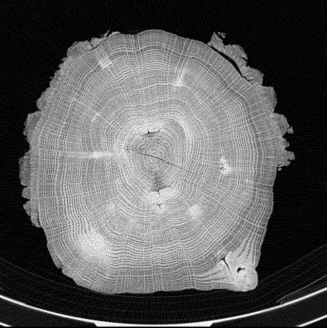
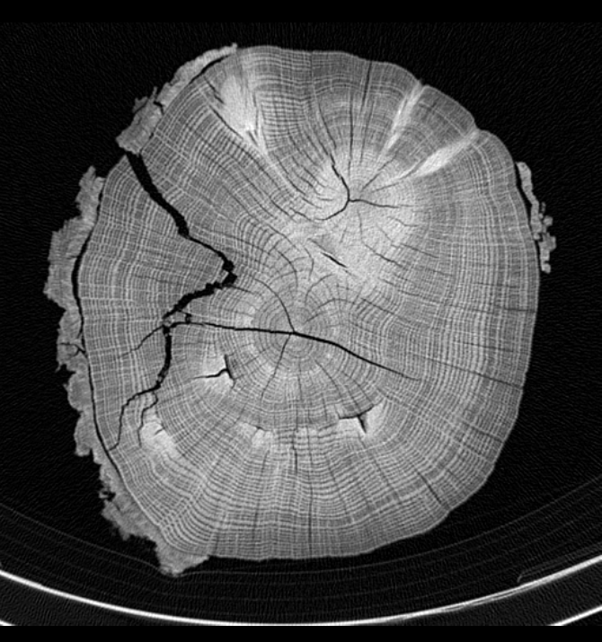
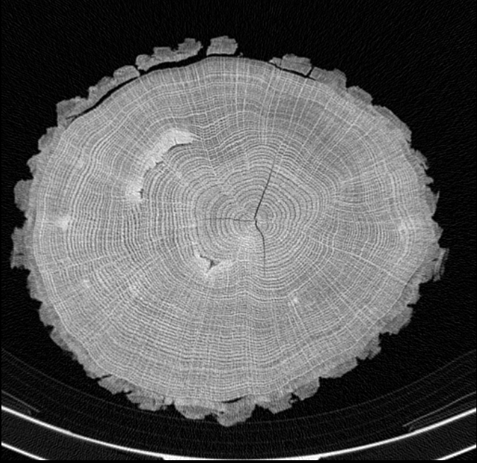
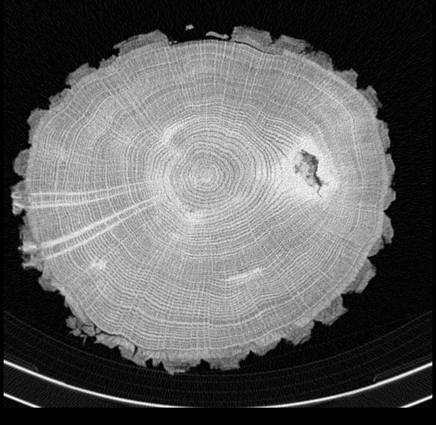
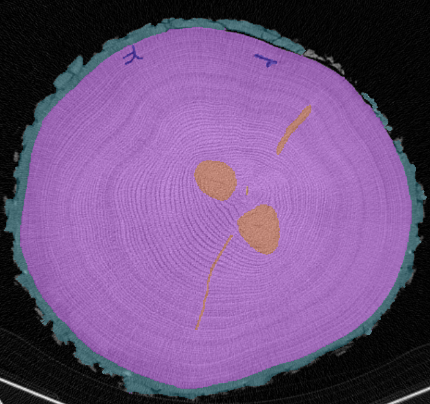
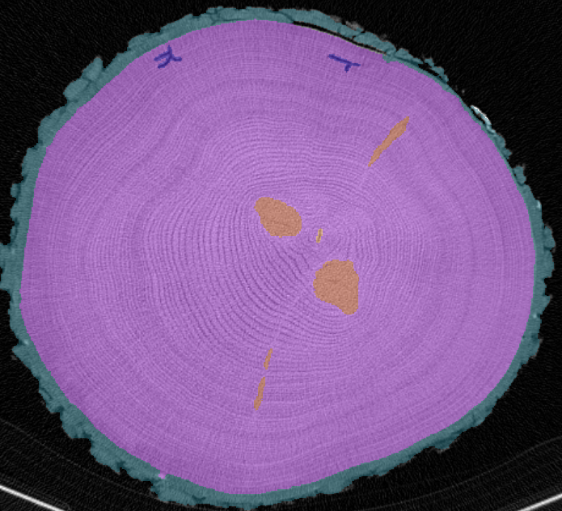
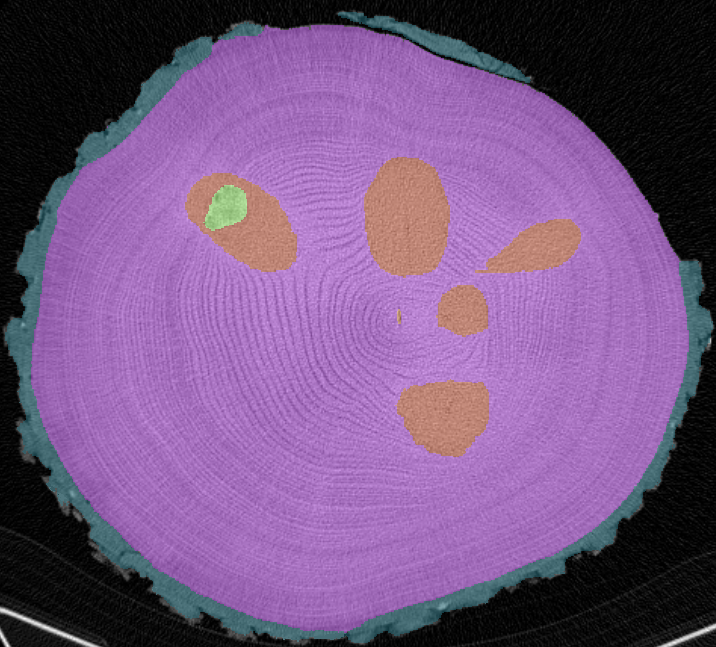
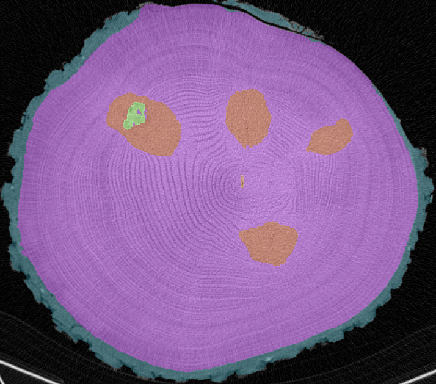
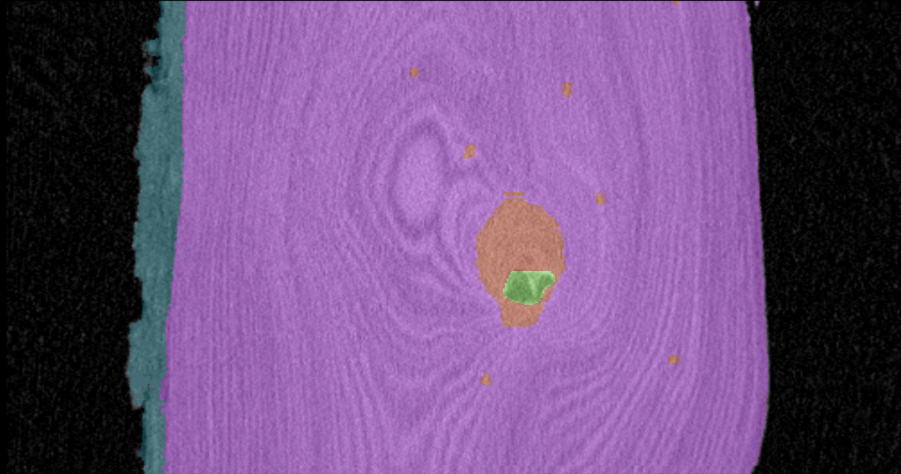
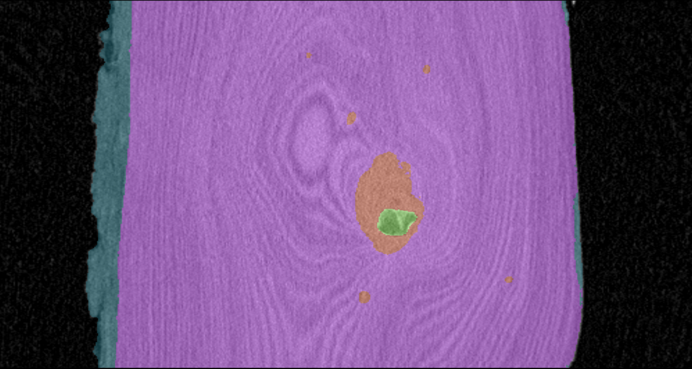

# Wood Defect Detection in CT Scans

Bachelor thesis project for automatic wood-defect segmentation in CT scans using nnU-Net v2, MONAI-based custom models, and classical preprocessing/postprocessing utilities.

**Classes:** Background (0), Healthy Wood (1), Knot (2), Rot (3), Bark (4), Crack (5), Insect Damage (6)

## Challenging CT Slices

| | |
|--|--|
|  |  |
| Incomplete bark and a vague boundary between the knot and the surrounding healthy wood. | Incomplete bark, a thin crack and a thicker crack, and an elongated rot region. |

| | |
|--|--|
|  |  |
| A thin crack and a thin elongated rot region. | Vague boundary between knot and rot. |

## Qualitative Prediction Examples

| Ground truth | Prediction |
|--|--|
|  |  |
| Ground truth: Healthy wood, Bark, Crack, Knot, Insect damage | Accurate: Bark, Crack, Insect damage; Inaccurate: Healthy wood, Knot |

| Ground truth | Prediction |
|--|--|
|  |  |
| Ground truth: Healthy wood, Bark, Crack, Knot, Insect damage | Accurate: Bark, Crack, Insect damage; Inaccurate: Healthy wood, Knot, Rot |

| Ground truth | Prediction |
|--|--|
|  |  |
| Ground truth: Healthy wood, Bark, Knot, Rot | Accurate: Knot, Rot; Inaccurate: Healthy wood, Bark |

## Setup

```bash
poetry install
```

Place raw data in `src/ground_truth/` as ZIP files or folders containing DICOM / IMA files.

## Entry Points

- `./run_preproccessing` - classical preprocessing pipeline: extract, convert, segment, export Datumaro, and optionally upload to CVAT
- `./run` - nnU-Net and custom-model pipeline entrypoint
- `./run_swinunetr` - shortcut for `./run custom-train --model-name swinunetr`
- `./run_mednext` - shortcut for `./run custom-train --model-name mednext`

## Project Layout

```text
src/
  preprocessing/   DICOM -> PNG conversion, classical segmentation, Datumaro helpers
    nn_UNet/         nnU-Net v2 pipeline, trainer variants, cluster submission helpers (moved to `src/implementation/nn_UNet`)
    custom_model/    MONAI training, inference, losses, transforms, dataset code (moved to `src/implementation/custom_model`)
  postprocessing/  Rule-based cleanup and analysis utilities
  unannotated_data/ Local raw and derived datasets (not tracked)
```

## Classical Preprocessing

Run extraction, conversion, segmentation, and Datumaro export:

```bash
./run_preproccessing
```

Useful options:

```bash
./run_preproccessing --masks kura,pozadi
./run_preproccessing --tree dub5 --skip-extract --skip-convert --masks trhlina,hniloba
./run_preproccessing --tree dub5 --skip-extract --skip-convert --upload
```

The script name keeps the original `preproccessing` spelling.

## nnU-Net and Custom Models

The `./run` entrypoint forwards to `src.implementation.nn_UNet.pipeline` and supports:

- `prepare`
- `plan`
- `train`
- `predict`
- `predict-tree`
- `all`
- `custom-train`
- `custom-predict`
- `custom-evaluate`

### nnU-Net workflow

Prepare the dataset:

```bash
./run prepare --overwrite
```

Plan and preprocess:

```bash
./run plan --verify-dataset-integrity
```

Train:

```bash
./run train --configuration 3d_fullres --fold 0
```

Predict on a tree and export Datumaro:

```bash
./run predict-tree \
    --tree DUB_4 \
    --ground-truth-root ./src/ground_truth \
    --segmentation-output-root ./predictions \
    --configuration 3d_fullres --fold 0 \
    --make-datumaro
```

Predict from a ZIP file:

```bash
./run predict \
    --input ./src/ground_truth/DUB_4.zip \
    --output ./predictions \
    --configuration 3d_fullres --fold 0
```

### Custom models

Supported model names in `custom-train`:

- `swinunetr` (default)
- `swinunetr_v2`
- `unetr`
- `basicunetplusplus`
- `mednext`
- `segmamba`

For the common cases, use the wrappers:

```bash
./run_swinunetr --output-dir ./output/swinunetr --epochs 1000 --batch-size 2
./run_mednext --output-dir ./output/mednext --epochs 1000 --batch-size 2
```

Train with an explicit dataset split:

```bash
./run custom-train \
    --model-name mednext \
    --image-dir ./src/implementation/nn_UNet/nnunet_data/nnUNet_raw/Dataset002_BPWoodDefectsSplit/imagesTr \
    --label-dir ./src/implementation/nn_UNet/nnunet_data/nnUNet_raw/Dataset002_BPWoodDefectsSplit/labelsTr \
    --output-dir ./output/mednext \
    --epochs 1000 --batch-size 2 --patch-size 128 384 128 \
    --learning-rate 1e-3 --rare-class-weight 15.0 \
    --num-workers 4 --grad-accumulation-steps 4 \
    --wandb --wandb-project "bp-custom-model"
```

Resume from a checkpoint:

```bash
./run custom-train ... --resume-checkpoint ./output/mednext/last_model.pth
```

Training outputs include `best_model.pth`, `last_model.pth`, `metrics_history.csv`, `training_curves.png`, and `run_summary.json`.

### Model comparison

| | nnU-Net | MedNeXt | SwinUNETR |
|--|--|--|--|
| Prediction |  |  |  |

## Postprocessing

```bash
poetry run python -m src.implementation.postprocessing.postprocess predictions/DUB_4.nii.gz predictions/DUB_4_pp.nii.gz
poetry run python -m src.implementation.postprocessing.postprocess predictions/ predictions_postprocessed/
```

Rules applied: rot near crack becomes crack, crack near bark becomes background, small background adjacent to rot becomes rot, and enclosed healthy-wood/background holes are filled with the surrounding defect class.

| Before | After |
|--------|-------|
|  |  |

## Cluster

Add `--clusterfit` and the relevant Slurm flags to any command. Recommended GPU: A100 40 GB.

### Prepare on CPU

```bash
./run prepare \
    --clusterfit --slurm-partition cpu \
    --slurm-cpus-per-task 16 --slurm-time 02:00:00
```

### Plan on CPU

```bash
./run plan \
    --clusterfit --slurm-partition cpu \
    --slurm-cpus-per-task 16 --slurm-time 04:00:00 \
    --configurations 3d_fullres
```

### Train nnU-Net on GPU

```bash
./run train \
    --clusterfit --slurm-partition gpu \
    --slurm-cpus-per-task 8 --slurm-gpu a100_40 --slurm-time 72:00:00 \
    --configuration 3d_fullres --fold 0 \
    --initial-lr 1e-3 --compile off --n-proc-da 4 --cpu-threads 1
```

### Train a custom model on GPU

```bash
./run custom-train \
    --clusterfit --slurm-partition gpu \
    --slurm-cpus-per-task 8 --slurm-gpu a100_40 --slurm-time 24:00:00 \
    --epochs 1000 --batch-size 2 --patch-size 128 384 128 \
    --learning-rate 1e-3 --rare-class-weight 30.0 \
    --num-workers 4 --grad-accumulation-steps 4 \
    --wandb --wandb-project "bp-custom-model"
```

### Predict on GPU

```bash
./run predict \
    --clusterfit --slurm-partition gpu --slurm-gpu a100_40 \
    --input ./src/ground_truth/DUB_4.zip \
    --output ./predictions \
    --configuration 3d_fullres --fold 0
```

## Useful Commands

```bash
poetry run python src/implementation/preprocessing/utils/zorder_cvat_fix.py --tree dub4
poetry run python src/implementation/preprocessing/conversion/predict2datumaro.py --tree DUB_4
```
